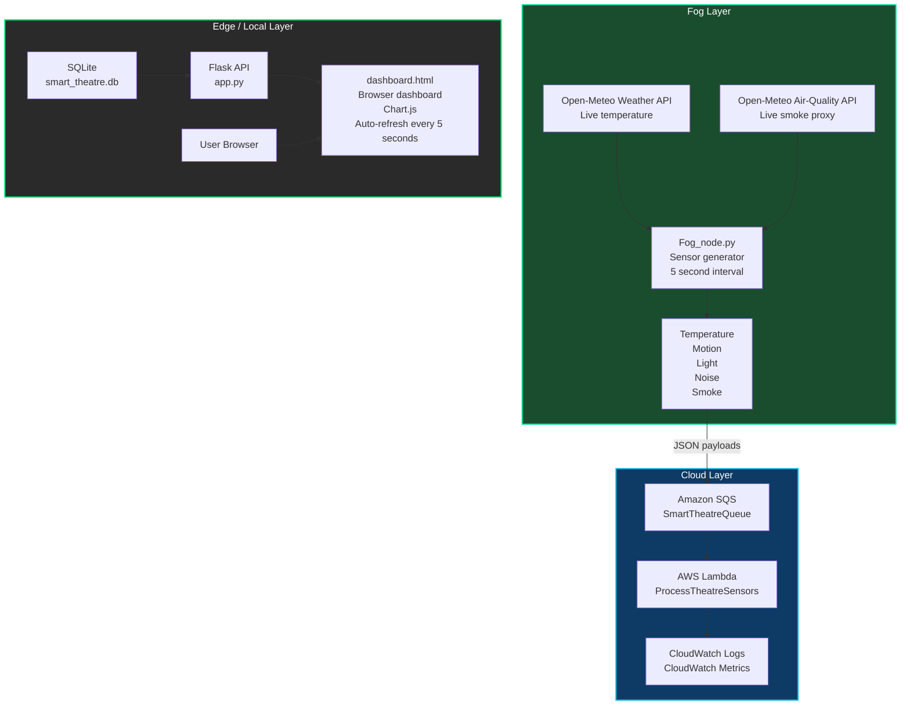

# Smart Theatre Monitoring System

Smart Theatre is a fog-to-edge monitoring demo that generates sensor readings, pulls live temperature and smoke data from public APIs, sends readings through AWS SQS and Lambda, stores them in SQLite, and visualizes the results in a Flask dashboard.

MQTT publishing is also supported from the fog generator so sensor readings can be consumed by pub/sub subscribers in parallel with SQS.

## Current Flow

1. `Fog_node.py` generates sensor readings every 5 seconds in the fog layer.
2. Temperature comes from the Open-Meteo weather API and smoke comes from the Open-Meteo air-quality API.
3. Sensor payloads are published to MQTT topics and also sent to Amazon SQS in the cloud layer.
4. AWS Lambda processes the SQS messages and logs them to CloudWatch.
5. AWS Lambda writes sensor readings into the local SQLite database (`smart_theatre.db`) on the backend host.
6. Flask reads from local SQLite and serves the dashboard API.
7. The edge layer is the browser dashboard that refreshes every 5 seconds and shows live values, timestamps, and trends.

## Architecture Diagram



## Layer Summary

### Fog Layer
- `Fog_node.py` creates the sensor stream.
- Values are generated every 5 seconds.
- Temperature is fetched from the Open-Meteo weather API.
- Smoke is fetched from the Open-Meteo air-quality API.
- The generator sends JSON readings to SQS.

### Cloud Layer
- SQS decouples the generator from processing.
- Lambda consumes queue messages.
- CloudWatch captures logs and metrics.
- EC2 can host the Flask backend, but SQLite remains a local file on that host.

### Edge / Local Layer
- The browser dashboard renders `dashboard.html`.
- The dashboard refreshes every 5 seconds and uses live timestamps.
- Users see the live charts, comfort score, and breakdown panels.

## Files

- `Fog_node.py` - fog-layer sensor generator
- `app.py` - Flask backend
- `lambda_handler.py` - AWS Lambda processor
- `dashboard.html` - browser dashboard
- `requirements.txt` - Python dependencies

## Run Locally

```bash
pip install -r requirements.txt
python app.py
python Fog_node.py
```

## MQTT Configuration (optional)

Set these environment variables in `.env` to enable and configure MQTT publishing from `Fog_node.py`:

- `MQTT_ENABLED=true`
- `MQTT_BROKER_HOST=localhost`
- `MQTT_BROKER_PORT=8883`
- `MQTT_USERNAME=`
- `MQTT_PASSWORD=`
- `MQTT_BASE_TOPIC=theatre/sensors`
- `MQTT_ALERTS_TOPIC=theatre/alerts`
- `MQTT_KEEPALIVE=60`
- `MQTT_USE_TLS=true`
- `MQTT_CA_CERT=certs/ca.crt`
- `MQTT_CLIENT_CERT=`
- `MQTT_CLIENT_KEY=`
- `MQTT_TLS_INSECURE=false`

Published topics:

- `theatre/sensors/<sensor>` for all readings
- `theatre/alerts/<sensor>` for warning/alert readings

## Notes

- `movie` mode is the only supported mode.
- The dashboard reads SQLite data written by `Fog_node.py`.
- `.env`, `smart_theatre.db`, and `__pycache__` should stay out of Git.