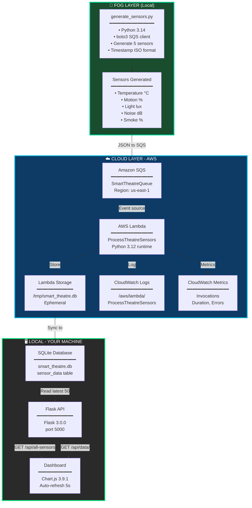

The Smart Theatre Monitoring System is a real-time, event-driven application designed to simulate and monitor environmental conditions inside a theatre using a modern cloud-based architecture. The system follows a strict and structured data pipeline where all sensor data flows through Amazon SQS and AWS Lambda before being stored and visualized. This ensures decoupling, scalability, and reliability in data processing.

The application begins in the fog layer, where a Python script (generate_sensors.py) generates sensor readings every five seconds. These readings include temperature, motion, light, noise, and smoke levels, each accompanied by a timestamp and status. Instead of writing directly to a database, the generated data is sent as JSON messages to an Amazon SQS queue (SmartTheatreQueue). This design ensures that the data generation process remains independent and loosely coupled from downstream systems.

Once messages are available in the queue, AWS Lambda (ProcessTheatreSensors) is automatically triggered. The Lambda function processes each message by validating and extracting the sensor data, then storing it in a SQLite database located in the /tmp directory. Since this storage is ephemeral, it represents temporary cloud-side processing. During execution, Lambda also logs all activities such as invocation details, execution duration, and errors to Amazon CloudWatch Logs, while performance metrics are recorded in CloudWatch Metrics. This provides complete visibility and monitoring of the system.

The processed data is then synchronized to a local SQLite database (smart_theatre.db), which acts as the single source of truth for the application. A Flask-based backend (app.py) reads data from this database and exposes REST APIs that allow the frontend to retrieve sensor values, historical data, and statistics. The frontend dashboard (dashboard.html), built using HTML, CSS, JavaScript, and Chart.js, consumes these APIs and updates the visualizations every five seconds. This creates a near real-time monitoring experience for users.

The entire architecture is divided into three logical layers. The fog layer handles data generation using Python and boto3. The cloud layer is responsible for processing and monitoring using AWS services such as SQS, Lambda, and CloudWatch. The local layer focuses on data storage, API exposure, and visualization using SQLite, Flask, and Chart.js. This separation of concerns makes the system modular and easy to maintain.

To run the project, the user needs to install dependencies, configure AWS credentials in a .env file, start the Flask backend, and run the sensor generator script. Once running, the dashboard can be accessed at http://localhost:5000, where sensor values and timestamps update automatically every five seconds. The correctness of the cloud pipeline can be verified by checking Lambda invocations and CloudWatch logs in the AWS console, as well as querying the local SQLite database.

This project demonstrates key concepts such as event-driven architecture, serverless computing, message queuing, real-time data processing, and cloud monitoring. It provides hands-on experience with integrating local applications and AWS services in a clean and scalable manner. Future improvements could include replacing SQLite with a managed database like Amazon RDS or DynamoDB, adding alerting mechanisms using SNS, and deploying the Flask application to the cloud for full end-to-end hosting.

# Smart Theatre Monitoring System

## Strict Single Flow: Generate → SQS → Lambda → SQLite → Dashboard

### End-to-end sequence (everything goes through SQS and Lambda)

1. **generate_sensors.py** generates sensor values every 5 seconds.
2. **Sensor payload sent to SQS** (`SmartTheatreQueue`).
3. **AWS Lambda** (`ProcessTheatreSensors`) triggered by SQS event.
4. **Lambda stores to SQLite** (`smart_theatre.db`) in `/tmp` (local ephemeral storage).
5. **Lambda logs to CloudWatch** (monitoring + audit trail).
6. **Flask app** (`app.py`) reads from local SQLite (rebuilt by Lambda writes).
7. **Dashboard** (`dashboard.html`) retrieves data via Flask API.
8. **Dashboard updates every 5 seconds** with latest timestamps.

### Key Points

- **No direct writes**: Generator sends ONLY to SQS, NOT directly to SQLite.
- **Lambda is the gatekeeper**: Processes all data from SQS before it reaches the database.
- **CloudWatch integration**: Every Lambda execution is logged (invocations, metrics, errors).
- **Single source of truth**: SQLite is populated only by Lambda, consumed only by Flask/Dashboard.

## Architecture Diagram

## Architecture Diagram (FOG → SQS → Lambda → Dashboard)



### Data Flow Steps

| # | Source | Action | Output | Tools |
|---|--------|--------|--------|-------|
| 1 | FOG | Generate 5 sensor readings | JSON `{sensor, value, status, unit, timestamp}` | `generate_sensors.py`, `boto3` |
| 2 | FOG → Cloud | Send to SQS queue | Message in queue | Amazon SQS |
| 3 | Cloud | Lambda triggered by SQS | Lambda invocation | AWS Lambda |
| 4 | Lambda | Parse & validate message | Extracted sensor data | Python 3.12 |
| 5 | Lambda | Store to SQLite | INSERT record | SQLite in `/tmp/` |
| 6 | Lambda | Log execution | START, END, REPORT | CloudWatch Logs |
| 7 | Lambda | Send metrics | Invocation count | CloudWatch Metrics |
| 8 | Dashboard | Query latest data | 50 records DESC → ASC | Flask API |
| 9 | Dashboard | Fetch every 5s | GET `/api/data/temperature` | `setInterval()` |
| 10 | Dashboard | Render charts | Plot points + update | Chart.js |

### Technologies by Layer

**FOG (Data Generation):**
- Python 3.14
- boto3 1.26.0 (AWS SDK)
- python-dotenv 1.0.0

**CLOUD (Processing):**
- Amazon SQS (message queue)
- AWS Lambda (serverless)
- CloudWatch Logs (audit trail)
- CloudWatch Metrics (monitoring)

**LOCAL (Display):**
- SQLite 3 (database)
- Flask 3.0.0 + CORS (backend)
- Chart.js 3.9.1 (charting)
- HTML5 + CSS3 + JavaScript (frontend)

### Tools Stack Summary
```
┌─────────────────────────────────────────────────────────┐
│ Development: VS Code | PowerShell | Browser DevTools   │
├─────────────────────────────────────────────────────────┤
│ FOG: Python 3.14 + boto3                               │
├─────────────────────────────────────────────────────────┤
│ Cloud: AWS (SQS, Lambda, CloudWatch)                   │
├─────────────────────────────────────────────────────────┤
│ Local: SQLite + Flask + Chart.js                        │
└─────────────────────────────────────────────────────────┘
```

### Application Stack
- Python 3.14
- Flask + Flask-CORS
- SQLite (`smart_theatre.db`)
- Chart.js (frontend graphs)
- python-dotenv
- boto3 (AWS SDK)

### AWS Services
- Amazon SQS (`SmartTheatreQueue`)
- AWS Lambda (`ProcessTheatreSensors`)
- Amazon CloudWatch Logs
- Amazon CloudWatch Metrics

### Development / Debug Tools Used During Setup
- VS Code
- PowerShell terminal
- Browser DevTools (network/console checks)
- API checks via `Invoke-WebRequest`

## Demo Steps (End-to-End)

### 1) Install dependencies
```bash
pip install -r requirements.txt
```

### 2) Configure `.env`
Set these keys:
- `AWS_ACCESS_KEY_ID`
- `AWS_SECRET_ACCESS_KEY`
- `AWS_SESSION_TOKEN` (if your lab uses temporary creds)
- `AWS_DEFAULT_REGION=us-east-1`
- `SQS_QUEUE_URL=https://sqs.us-east-1.amazonaws.com/<account>/SmartTheatreQueue`

### 3) Start Flask backend
```bash
python app.py
```

### 4) Start sensor generator (new terminal)
```bash
python generate_sensors.py
```

### 5) Open dashboard
- URL: `http://localhost:5000`
- Expected: values and timestamps update every ~5 seconds.

### 6) Verify cloud path
In AWS Console:
1. Go to **Lambda → ProcessTheatreSensors**.
2. Open **Monitoring** and check invocations increasing.
3. Open **CloudWatch Logs** log group:
   - `/aws/lambda/ProcessTheatreSensors`
4. Use recent time range (last 5–15 min) and refresh/log tail.

### 7) Verify SQLite and dashboard path
Run:
```bash
python -c "import sqlite3; c=sqlite3.connect('smart_theatre.db'); cur=c.cursor(); cur.execute('select sensor,timestamp,value,status from sensor_data order by timestamp desc limit 5'); print(cur.fetchall()); c.close()"
```

Then open:
- `http://localhost:5000/dashboard.html`
- Confirm timestamps move every 5 seconds.

## API Endpoints

- `GET /api/all-sensors` → latest value for all sensors
- `GET /api/data/<sensor>?limit=50` → chart data for one sensor
- `GET /api/stats/<sensor>` → min/max/avg/count
- `GET /api/health` → service health

## Notes

- Flask no longer consumes SQS (to avoid competing with Lambda).
- Dashboard data is sourced from local SQLite entries written by `generate_sensors.py`.
- Lambda logs/metrics confirm SQS → Lambda processing in cloud.
- If CloudWatch log stream list looks stale, use **Live tail** or set recent time range and refresh.
# trigger


